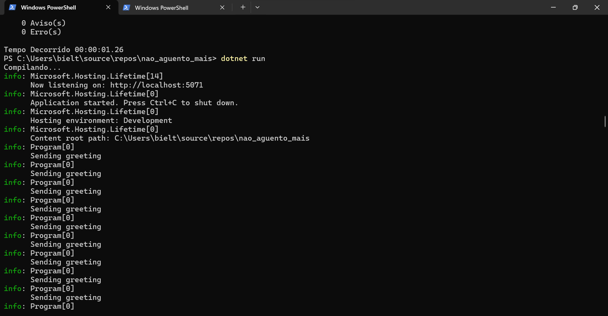
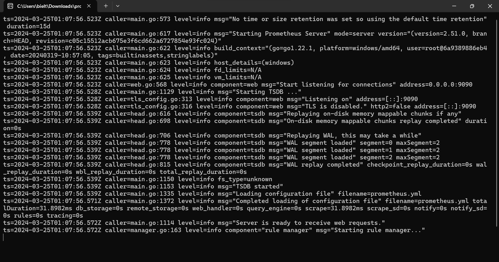
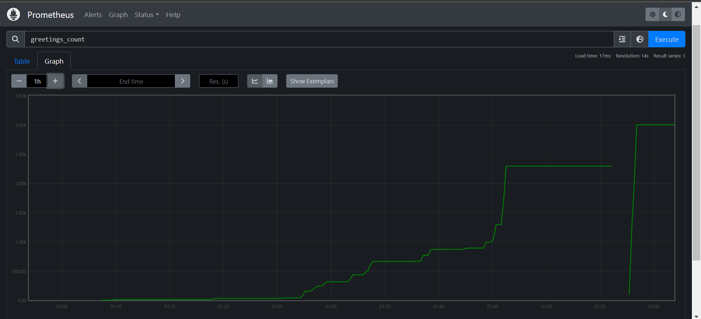
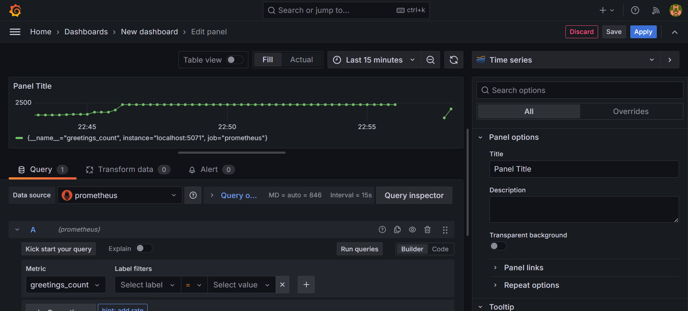
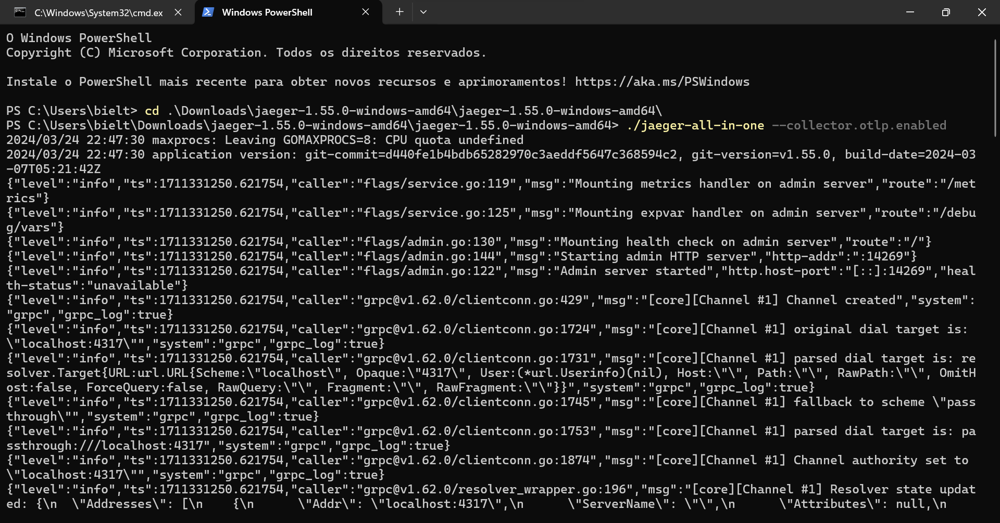
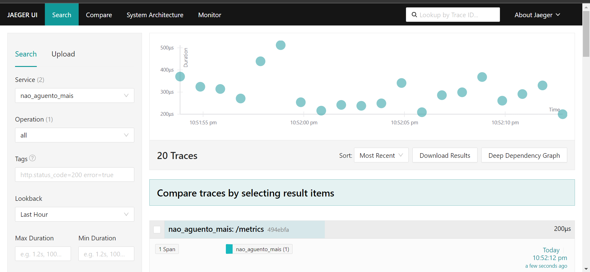

# Relatório da atividade

## Print de conexão do repositório

## Print de conexão com Prometheus

## Print do Prometheus

## Print do Grafana

## Print de conexão com o Jaeger

## Print do Jaeger

## Tecnologia
O OpenTelemetry é uma tecnologia de código aberto que oferece uma maneira padronizada e flexível de coletar e emitir dados de telemetria em sistemas distribuídos. Ele fornece APIs para gravação de dados de telemetria durante a execução do código, bem como exportadores para enviar esses dados para sistemas de monitoramento de desempenho de aplicativos (APMs). Na implementação .NET, o OpenTelemetry utiliza APIs nativas do .NET, como ILogger, Meter e ActivitySource, facilitando a integração em aplicativos .NET.

## Conhecimentos aprendidos
Durante o tutorial, explorei os fundamentos da observabilidade em sistemas distribuídos, que incluem três pilares principais: logs, métricas e rastreamento distribuído. Aprendi a importância de registrar logs para capturar eventos significativos durante a execução do aplicativo, o uso de métricas para medir o desempenho e o comportamento do sistema e a implementação de rastreamento distribuído para acompanhar o fluxo de solicitações por vários serviços.

Além disso, aprendi a configurar o OpenTelemetry em um projeto .NET, incluindo a definição de métricas e atividades, referenciando os pacotes NuGet relevantes e configurando exportadores para sistemas como Prometheus, Grafana e Jaeger. 